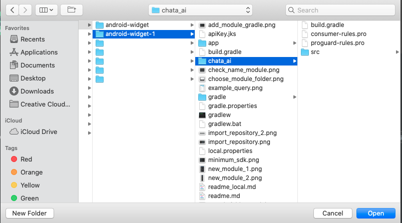
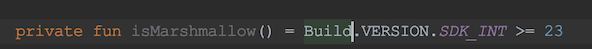
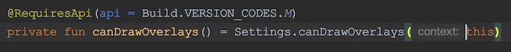
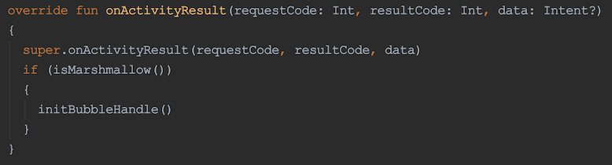

# Data Messenger
> Deliver the power of AutoQL to your users through Data Messenger, a state-of-the-art conversational interface you can easily build into your existing application.
<!-- [Support by Android version](#support-by-android-version) -->

## About Data Messenger

> Data Messenger is a conversational user interface (CUI). It is a flexible frontend widget that can be implemented and accessed within an existing application or software interface. Data Messenger enables users to interact conversationally with their data by entering natural language queries to receive information from their database (or more simply, allows users to ask questions in their own words to receive data-related responses).

>Throughout this document, the words "Data Messenger" and "widget" are used interchangeably. All widget components are open source, so Data Messenger is highly customizable in terms of both function and design.


## Setting Up Data Messenger

### Controlled Component
> This widget is a controlled component in terms of its visibility. The Integrator is in full control of the visual state of Data Messenger within their application, making it easy to trigger the slide-in or slide-out functionality programmatically.

>> Note: The data messenger component can only be used in SDK version 17 or higher. This is shown below.


> If we want to incorporate the Data messenger widget it is necessary to download it from https://gitlab.com/chata-widget/android-widget.
> To download the source code we have 2 ways:
> 1. Download directly from the repository https://gitlab.com/chata-widget/android-widget.
> 2. Download via Android Studio.

#### Download directly from the repository

> Download directly from the repository https://gitlab.com/chata-widget/android-widget.

#### Download via Android Studio

> We open Android Studio, select *Check out project from Version Control*, select *Git*.


> We enter url _https://gitlab.com/chata-widget/android-widget_. We can press *Test* to verify the existence of the repository. In _Directory_ we select the download destination. At the end to download the repository press *Clone*.


> Now in the project we want to import the Data Messenger component.
> Let's follow the following instructions:
>
> In the menu File | New | Import Module...


> Next we look for the source code location where Data Messenger is located.


> In the Finder window, we will look for the folder where we downloaded the gitlab repository.
>
> We look for the downloaded repository folder and inside the folder we select the `chata_ai` folder.
>
> Then we click on `open`.



> After opening the `chata_ai` folder. We see the following window.
>
> The text inside the `Module name` box is the name of the module that will be imported into the project.


> The next step is to add the library to our build.gradle (Module: app) file.
>
> Add the line `implementation project (': chata_ai')`.
>
> Then we click on `Sync now` to synchronize the library with the project.


### Add source code in project

> Let's start with the declaration and initiation of the variable bubbleHandle (BubbleHandle).


> To use this component we must make some decisions regarding the version of the device.
> We are going to determine if the device where our application will be executed is equal to or greater than Marshmallow.



> Another thing to consider is the on-screen overlay, for this we must give the application permission to see the BubbleHandle element on our screen.
>
> The way to evaluate that the overlay is active for our application is as follows.



> For a better understanding we are going to create the `initBubble` method to start our bubbleBundle.


> Now, if the user has not accepted the screen overlay permissions for our application, we are going to call an intent so that the user can accept it.
> In turn, we are going to read the result once the user exits the overlay permission screen.
> Once the user accepts the permissions, we start the BubbleHandle component.


1. *Una vez es creada la actividad, es evaluada la versión de Android que corre nuestro disposiivo, si es igual o mayor a Marshmallow entrará en la primera sentencia `if`. Otherwise we start our BubbleHandle.*
2. *En la segunda sentencia `if` revisamos la superposición de pantalla para nuestra App, si esta no ha sido aceptada mostramos la pantalla de permiso de superposición. Otherwise we start our BubbleHandle.*



*The response is read and checked if the user accepted the overlay permissions.*

> Once the app is installed you will see something similar to the following video.
>


## Props
<table>
  <thead>
    <tr><th>Prop Name</th><th>Data Type</th><th>Default Value</th></tr>
  </thead>
  <tbody>
    <tr><td>isVisible</td><td>Boolean</td><td>true</td></tr>
    <tr><td>placement</td><td>Int: TOP_PLACEMENT || BOTTOM_PLACEMENT || LEFT_PLACEMENT || RIGHT_PLACEMENT || NOT_PLACEMENT</td><td>RIGHT_PLACEMENT</td></tr>
    <tr><td>title</td><td>String</td><td>"Data Messenger"</td></tr>
    <tr><td>userDisplayName</td><td>String</td><td>"there"</td></tr>
    <tr><td>introMessage</td><td>String</td><td>"Hi %s! Let\'s dive into your data. What can I help you discover today?"</td></tr>
    <tr><td>inputPlaceholder</td><td>String</td><td>"Type your queries here"</td></tr>
    <tr><td>maxMessages</td><td>Int</td><td>0</td></tr>
    <tr><td>clearOnClose</td><td>Boolean</td><td>false</td></tr>
    <tr><td>enableVoiceRecord</td><td>Boolean</td><td>true</td></tr>
    <tr><td>autoQLConfig</td><td>AutoQLConfig</td><td>AutoQLConfig()</td></tr>
    <tr><td>dataFormatting</td><td>DataFormatting</td><td>DataFormatting()</td></tr>
    <tr><td>theme</td><td>String: "light" || "dark"</td><td>"light"</td></tr>
    <tr><td>lightThemeColor</td><td>String</td><td>"#28A8E0"</td></tr>
    <tr><td>darkThemeColor</td><td>String</td><td>"#525252"</td></tr>
    <tr><td>aChartColors</td><td>ArrayList&lt;E&gt;</td><td>ArrayList()</td></tr>
  </tbody>
</table>

>`isVisible`: Determines whether the Bubble Handle view is visible on the screen or not.
```kotlin
//isChecked is a Boolean
bubbleHandle.isVisible = isChecked
```
>`placement`: Determines the edge of the screen where Bubble Handle is placed.
```kotlin
//placement is a Integer
//Constant -> TOP_PLACEMENT || BOTTOM_PLACEMENT || LEFT_PLACEMENT || RIGHT_PLACEMENT || NOT_PLACEMENT
bubbleHandle.placement = placement
```
>`title`: Text that appears in the header of the default Data Messenger
view. You must provide an empty string if you do not want text to appear
here, otherwise the default text (Data Messenger) will apply.
```kotlin
//title is a String
bubbleHandle.title = title
```
>`userDisplayName`: Name used in the intro message (example. "Hi Carlos!").
You can customize this value using names from your own source database.
```kotlin
//userDisplayName is a String
bubbleHandle.userDisplayName = userDisplayName
```
>`introMessage`: Customize the default intro message using your own brand
voice and custom copy. The userDisplayName prop will be ignored if this
is provided.
```kotlin
//introMessage is a String
bubbleHandle.introMessage = introMessage
```
>`inputPlaceholder`: Customize the placeholder for the Query Input
(natural language query search bar).
```kotlin
//inputPlaceholder is a String
bubbleHandle.inputPlaceholder = inputPlaceholder
```
>`maxMessages`: Maximum number of messages that can be displayed in the
Data Messenger interface at one time. A message is any input or any
output in the interface. This means a query entered by a user
constitutes one message, and the response returned in the Data Messenger
interface constitutes another message. If a new message is added and you
have reached the maximum, the oldest message will be erased.
```kotlin
//maxMessages is a Int
bubbleHandle.maxMessages = maxMessages
```
>`clearOnClose`: Determines whether or not to clear all messages when the
widget is closed. Note: The default intro message will appear when you
reopen the widget after closing it.
```kotlin
//clearOnClose is a Boolean
bubbleHandle.clearOnClose = clearOnClose
```
>`enableVoiceRecord`: Enable the speech to text button.
Note: The speech to text function uses SpeechRecognizer which works when the "Manifest.permission.RECORD_AUDIO" permission is accepted by the user.
```kotlin
//enableVoiceRecord is a Boolean
bubbleHandle.enableVoiceRecord = enableVoiceRecord
```
> `theme`: Color theme for Data Messenger. There are currently two options: light theme and dark theme. For a light theme we will use 'light' and for a dark theme we will use 'dark'.
```kotlin
//theme is a String "light" else "dark"
bubbleHandle.theme = theme
```
> `lightThemeColor`: Primary accent color used in Data Messenger. This is the color of the header, speech-to-text button, and the messages displayed in the interface (both natural language query inputs from users and the associated responses that are generated and returned to the user). The visualization (table and chart) colors will not be affected here. This color is used when the light theme is active.
```kotlin
//lightThemeColor is a String, its format is #FFFFFF
bubbleHandle.setLightThemeColor(lightThemeColor)
```
> `darkThemeColor`: Primary accent color used in Data Messenger. This is the color of the header, speech-to-text button, and the messages displayed in the interface (both natural language query inputs from users and the associated responses that are generated and returned to the user). The visualization (table and chart) colors will not be affected here. This color is used when the dark theme is active.
```kotlin
//darkThemeColor is a String, its format is #FFFFFF
bubbleHandle.setDarkThemeColor(darkThemeColor)
```
> `aChartColors`: Array of color options for the chart visualization themes, starting with the most primary. You can pass any valid CSS color format in here, however it is recommended that the color is opaque (ex. "#26A7E9"). Charts will always apply the colors in order from first to last. If the visualization requires more colors than provided, all colors will be used and then repeated in order.

> `changeColor(indexColor: Int, valueColor: String)`: With the change Color method you will update the color in index Color and the color value of the color to update will be valueColor.
```kotlin
//indexColor is a Int; valueColor is a valueColor
bubbleHandle.changeColor(indexColor, valueColor)
```
> `addChartColor(valueColor: String): Boolean`: Add one more color to aChartColors. The color format must be hexadecimal. (Ex. # FF00FF).

```kotlin
//valueColor is a String
bubbleHandle.addChartColor(valueColor)
```

#### autoQLConfig Prop
<table>
  <thead>
    <tr><th>Key</th><th>Data Type</th><th>Default Value</th></tr>
  </thead>
  <tbody>
    <tr><td>enableAutocomplete</td><td>Boolean</td><td>true</td></tr>
    <tr><td>enableQueryValidation</td><td>Boolean</td><td>true</td></tr>
    <tr><td>enableQuerySuggestions</td><td>Boolean</td><td>true</td></tr>
    <tr><td>enableDrilldowns</td><td>Boolean</td><td>true</td></tr>
    <tr><td>enableColumnVisibilityManager</td><td>Boolean</td><td>true</td></tr>
    <tr><td>debug</td><td>Boolean</td><td>true</td></tr>
  </tbody>
</table>

>`enableAutocomplete`: Automatically populates similar query suggestions as users enter a query, so they get results more quickly and easily. If enabled, suggested queries will begin to appear above the Query Input bar as the user types.
```kotlin
//enableAutocomplete is a Boolean
bubbleHandle.autoQLConfig.enableAutocomplete = enableAutocomplete
```
>`enableQueryValidation`: Catches and verifies references to unique data, so users always receive the data they need. If enabled, the natural language query entered by a user will first go through the validate endpoint. If the query requires validation (ex. the input contains reference to a unique data label), suggestions for that label will be returned in a subsequent message, allowing the user to verify their input before executing their query.
```kotlin
//enableQueryValidation is a Boolean
bubbleHandle.autoQLConfig.enableQueryValidation = enableQueryValidation
```
>>For example: If you query, 'How much money does Carlos owe me?', validation may detect that there is no 'Carlos' label, but there are labels called 'Karlo', and 'carlo' in your database. The message will then let you select the appropriate label and run the corresponding query.

>>If this value is false, the query will bypass the validate endpoint and be sent straight to the query endpoint.

>`enableQuerySuggestions`: Enables option for user to clarify meaning in cases where their original query lacked context or could be interpreted in multiple different ways. If enabled, in cases where the query input was ambiguous, a list of suggested queries will be returned for the user to choose from, leading to more efficient and accurate responses. If this is false, a general error message will appear in its place.
```kotlin
//enableQuerySuggestions is a Boolean
bubbleHandle.autoQLConfig.enableQuerySuggestions = enableQuerySuggestions
```
>`enableDrilldowns`: When a table or chart element is clicked by a user, a new query will run automatically, allowing the user to "drilldown" into the data to obtain a detailed breakdown of the figure returned by entry. If this is false, nothing will happen when a table or chart element is clicked.
```kotlin
//enableDrilldowns is a Boolean
bubbleHandle.autoQLConfig.enableDrilldowns = enableDrilldowns
```
>`enableColumnVisibilityManager`: Column Visibility Manager allows the user to control the visibility of individual columns when query results are returned in a table. Users can access the Column Visibility Manager to adjust their visibility preferences by clicking the "eye" icon in the Options Toolbar and selecting or deselecting columns. Once set, visibility preferences will be persisted. Any future query containing columns that were previously shown or hidden by the user will also reflect these changes. The user can access the Column Visibility Manager to make changes to these visibility preferences at any time.
```kotlin
//enableColumnVisibilityManager is a Boolean
bubbleHandle.autoQLConfig.enableColumnVisibilityManager = enableColumnVisibilityManager
```
>`debug`: If this value is true, the user can copy the full query language (QL) statement (ex. SQL statement) that was dynamically generated from their natural language query input by clicking "Copy generated query to clipboard".
```kotlin
//debug is a Boolean
bubbleHandle.autoQLConfig.debug = debug
```
#### dataFormatting Prop
<table>
  <thead>
    <tr><th>Key</th><th>Data Type</th><th>Default Value</th></tr>
  </thead>
  <tbody>
    <tr><td>currencyCode</td><td>String</td><td>"USD"</td></tr>
    <tr><td>languageCode</td><td>String</td><td>"en-US"</td></tr>
    <tr><td>currencyDecimals</td><td>Int</td><td>2</td></tr>
    <tr><td>quantityDecimals</td><td>Int</td><td>1</td></tr>
    <tr><td>monthYearFormat</td><td>String</td><td>"MMM YYYY"</td></tr>
    <tr><td>dayMonthYearFormat</td><td>String</td><td>"MMM DD, YYYY"</td></tr>
  </tbody>
</table>

>`currencyCode`: If your data is not in USD, you can specify a different currency code here. All visualizations (tables and charts) will show the default currency formatting for the specified code.
```kotlin
//currencyCode is a String
bubbleHandle.dataFormatting.currencyCode = currencyCode
```
>`languageCode`: If the currency code from your country requires letters not contained in the English alphabet in order to show symbols correctly. This is not support.
```kotlin
//languageCode is a String
bubbleHandle.dataFormatting.languageCode = languageCode
```
>`currencyDecimals`: Number of digits to display after a decimal point for currencies.
```kotlin
//currencyDecimals is a Integer
bubbleHandle.dataFormatting.currencyDecimals = currencyDecimals
```
>`quantityDecimals`: Number of digits to display after a decimal point for quantity values.
```kotlin
//quantityDecimals is a Int
bubbleHandle.dataFormatting.quantityDecimals = quantityDecimals
```
>`monthYearFormat`: The format to display the representation of a whole month. AutoQL uses SimpleDateFormat("format", Locale.US). You can see https://developer.android.com/reference/java/text/SimpleDateFormat
```kotlin
//monthYearFormat is a String
bubbleHandle.dataFormatting.monthYearFormat = monthYearFormat
```
>`dayMonthYearFormat`: The format to display the representation of a single day. (ie. March 18, 2020). AutoQL uses SimpleDateFormat("format", Locale.US). You can see https://developer.android.com/reference/java/text/SimpleDateFormat
```kotlin
//dayMonthYearFormat is a String
bubbleHandle.dataFormatting.dayMonthYearFormat = dayMonthYearFormat
```